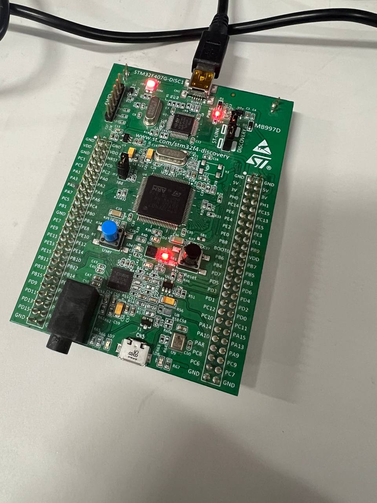

# STM32 Project-1

1. Зажигание светодиода LED. Код:
```  
HAL_GPIO_WritePin(GPIOD, LED_Pin, GPIO_PIN_RESET);  
HAL_Delay(1000);  
HAL_GPIO_WritePin(GPIOD, LED_Pin, GPIO_PIN_SET);  
HAL_Delay(1000);
```
2. Аналогично с задержкой в 2 секунды вкл/выкл. Код:
```   
while (1)
  {
    /* USER CODE END WHILE */

    /* USER CODE BEGIN 3 */
	  if(flag == 1){
		  if(HAL_GetTick() - T >= 2000){
			  flag = 0;
			  T = HAL_GetTick();
		  }
	  }
	  if(flag == 0){
	  		  if(HAL_GetTick() - T >= 2000){
	  			  flag = 1;
	  			  T = HAL_GetTick();
	  		  }
	  	  }
	  HAL_GPIO_WritePin(GPIOD, LED_Pin, flag);
  }
  /* USER CODE END 3 */
}
```

