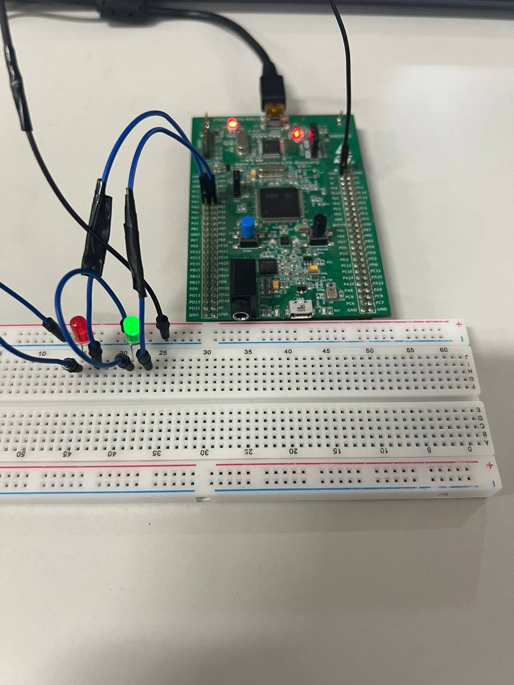

## STM32 Project-3  PWM на практике.
1. Использование широтно-импульсной модуляции в контроллерах STM32, в частности в STM32F407. 
Таймер TIM2 на входах PA0 и PA1 настроен на PWD. Этот тамер является 32 битным.
2. Схема: 

3. Основной код:
```
if (HAL_GetTick() - T >= 1) {
			T = HAL_GetTick();
			if (flag) {
				TIM2->CCR1 = i;
				TIM2->CCR2 = 255 - i;
				i++;
				if (i == 255) {
					i = 0;
					flag = 0;
				}
			}
			if (!flag) {
				TIM2->CCR2 = i;
				TIM2->CCR1 = 255 -i;
				i++;
				if (i == 255) {
					i = 0;
					flag = 1;
				}
			}
}
```
4. Результат:
