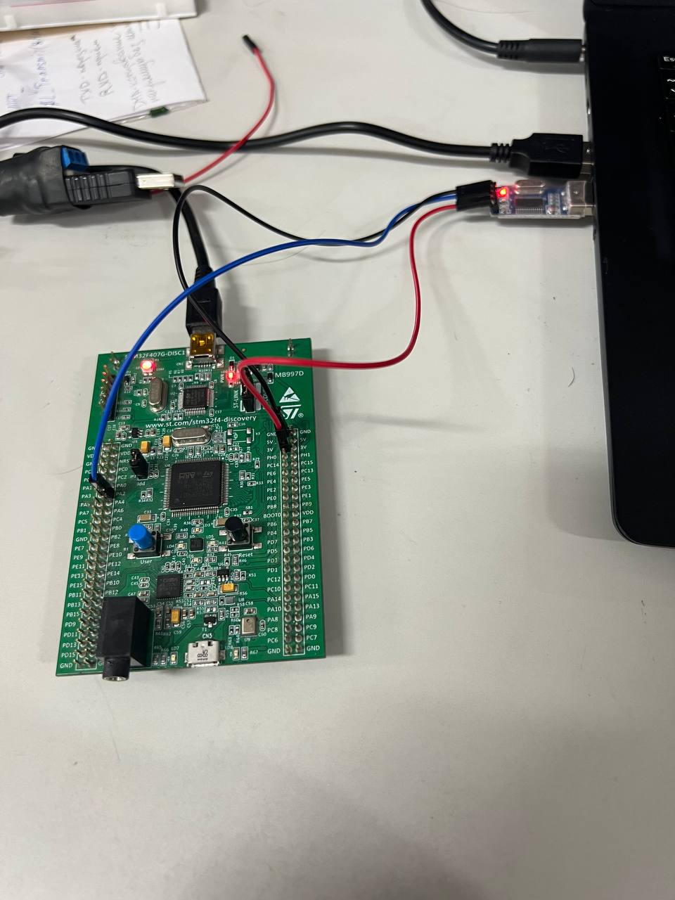

## STM32 Project-4  UART на практике.
1. Использование интерфейса UART для передачи по TxD. Без прерываний.
2. Код:
```
 while (1)
  {
    /* USER CODE END WHILE */

    /* USER CODE BEGIN 3 */
	  if(HAL_GetTick() - T >= 1000){
		  T = HAL_GetTick();
		  HAL_UART_Transmit(&huart2, (uint8_t*)buffer, strlen(buffer), HAL_MAX_DELAY);
		  HAL_UART_Transmit(&huart2, (uint8_t*)buffer_2, strlen(buffer_2), HAL_MAX_DELAY);
		  HAL_UART_Transmit(&huart2, (uint8_t*)buffer_3, sprintf(buffer_3, "UART_sprintf\n\r"), 0xFFFF);
		  HAL_UART_Transmit(&huart2, (uint8_t*)buffer_3, sprintf(buffer_3, "Chislo = %.5f \n\r", pi), 0xFFFF);
	  }
  }
```
3. Включаем прирывания и DMA. Так как отравка двух сообщени одновременно не может происходить, так как шина занята и равна HAL_UART_STATE_BUSY_TX - не готова к приему, нужно это дело обойти.
4. Код:
```
  while (1)
  {
    /* USER CODE END WHILE */

    /* USER CODE BEGIN 3 */
	  if(HAL_GetTick() - T <= 1000 && flag != 255){
		  T = HAL_GetTick();
		  if(flag == 1 && huart2.gState != HAL_UART_STATE_BUSY_TX){
			  HAL_UART_Transmit_IT(&huart2, (uint8_t*)buffer, strlen(buffer));
			  flag = 2;
		  }
		  else if(flag == 2 && huart2.gState != HAL_UART_STATE_BUSY_TX){
		  HAL_UART_Transmit_IT(&huart2, (uint8_t*)buffer_2, strlen(buffer));
		  flag = 255;
		  }
	  } else if (HAL_GetTick() - T >= 1000 && flag == 255){
		  T = HAL_GetTick();
		  flag = 1;
	  }
  }
  ```
5. Схема проекта:  
